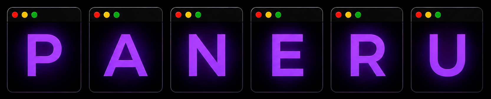

<div align="center">
  
</div>

# Spool

A sliding, tiling window manager for macOS, built around a continuous strip of
windows that moves like film through a camera.

Spool is a fork of [Paneru](https://github.com/karinushka/paneru), the original
Bevy-based macOS window manager. It preserves Paneru's core idea: windows live
on an infinite horizontal strip, and opening a new window never resizes the
existing layout. The project is renamed here to reflect the film-spool motion
of that strip while keeping the original project and its authorship explicit.

## About

Spool is a macOS window manager that arranges windows on an infinite strip,
extending to the right. A core principle is that opening a new window will
**never** cause existing windows to resize, maintaining your layout stability.

Each monitor operates with its own independent window strip, ensuring that
windows remain confined to their respective displays and do not "overflow" onto
adjacent monitors.

https://github.com/user-attachments/assets/cbc2e820-635f-408b-923a-6cb47c44704c

(Video by @emreekici3 - https://github.com/emreekici3/dotfiles)

https://github.com/user-attachments/assets/793e7eaa-7909-4086-8380-1fb7861f8780


## Why Spool?

- **Niri-like Behavior on MacOS:** Inspired by the user experience of [Niri],
  Spool aims to bring a similar scrollable tiling workflow to MacOS.
- **Works with MacOS workspaces:** You can use existing workspaces and switch
  between them with keyboard or touchpad gestures - with a separate window strip
  on each. Drag and dropping windows between them works as well.
- **One layout per native Space:** macOS owns Space topology and visibility;
  Spool keeps an independent ordered column strip for every native Space.
- **Built-in workspace Bar:** The Rust Bar runs inside the Spool process on
  every display, showing all Spaces, the current Space's column layout,
  floating windows, fullscreen/empty state, and exact focused window.
- **Startup session restore:** Restores tracked window layouts, virtual
  workspaces, and display assignments from the last saved state when Spool
  starts.
- **Focus follows mouse on MacOS:** Very useful for people who would like to
  avoid an extra click.
- **Sliding windows with touchpad:** Using a touchpad is quite natural for
  navigation of the window pane.
- **Native macOS tabs support:** Applications like Ghostty use these, so
  Spool manages them on the layout strip like other windows.
- **Optimal for Large Displays:** Standard tiling window managers can be
  suboptimal for large displays, often resulting in either huge maximized
  windows or numerous tiny, unusable windows. Spool addresses this by
  providing a more flexible and practical arrangement.
- **Improved Small Display Usability:** On smaller displays (like laptops),
  traditional tiling can make windows too small to be productive, forcing users
  to constantly maximize. Spool's sliding strip approach aims to provide a
  better experience without this compromise.

## Inspiration

The fundamental architecture and window management techniques are heavily
inspired by [Yabai], another excellent MacOS window manager. Studying its
source code has provided invaluable insights into managing windows on MacOS,
particularly regarding undocumented functions.

The innovative concept of managing windows on a sliding strip is directly
inspired by [Niri] and [PaperWM.spoon].

## Installation

### Recommended System Options

- Like all non-native window managers for MacOS, Spool requires accessibility
  access to move windows. Once it runs you may get a dialog window asking for
  permissions. Otherwise check the setting in System Settings under "Privacy &
  Security -> Accessibility".

- Check your System Settings for "Displays have separate spaces" option. It
  should be enabled so Spool can track each display's Spaces independently.

- **Multiple displays**. Spool is moving the windows off-screen, hiding them
  to the left or right. If you have multiple displays, for example your laptop
  open when docked to an external monitor you may experience weird behavior.
  The issue is that when MacOS notices a window being moved too far off-screen
  it will relocate it to a different display - which confuses Spool! The
  solution is to change the spatial arrangement of your additional display -
  instead of having it to the left or right, move it above or below your main
  display.
  A [similar situation](https://nikitabobko.github.io/AeroSpace/guide#proper-monitor-arrangement)
  exists with Aerospace window manager.
  An option exists (`horizontal_mouse_warp`) which can make a vertical
  arrangement of displays "feel" horizontal.

- **Off-screen window slivers**. Because macOS will forcibly relocate windows
  that are moved fully off-screen, Spool keeps a thin sliver of each
  off-screen window visible at the screen edge. The `sliver_width` and
  `sliver_height` options control the size of this sliver. This is a
  workaround for a macOS limitation, not a design choice.

### Installing from source

```shell
$ git clone https://github.com/wxxxcxx/spool.git
$ cd spool
$ cargo build --release
$ cargo install --path .
```

Cargo builds include the embedded Lua runtime with a vendored LuaJIT by
default. Use `cargo build --release --no-default-features` for a build without
Lua support.

It can run directly from the command line or as a service.
Note that you will need to grant accessibility privileges to the binary.

### Installing with Nix

See [`docs/NIX.md`](docs/NIX.md).

### Configuration

Spool uses one Lua configuration for the window manager and built-in Bar.
Configuration discovery checks these locations in order:

1. `$SPOOL_LUA` (an existing file)
2. `$HOME/.spool.lua`
3. `$XDG_CONFIG_HOME/spool/init.lua` (normally `~/.config/spool/init.lua`)

If none exists, Spool creates the [default init.lua](config/default.lua) in the
XDG config directory without overwriting an existing script. TOML configuration
(`spool.toml`, `bar.toml`, `~/.spool`, and `SPOOL_CONFIG`) is no longer supported.
Existing TOML files are left untouched but are not read, created, or watched.

Save the active script to reload settings, Bar appearance, and keybindings.
A failed reload keeps the last working configuration. Omitted settings use
built-in defaults; removing `bar` or `spool.setup` also restores their defaults.
Builds without the `lua` feature use built-in defaults only.

See the **[Configuration Guide](docs/CONFIGURATION.md)** and
**[Lua Scripting Guide](docs/SCRIPTING.md)** for options and actions.

```lua
-- init.lua
spool.setup {
  options = { focus_follows_mouse = true, mouse_follows_focus = true },
  bar = { show_workspace_labels = true },
}

spool.bind("cmd+h", spool.action.window.focus_west)
spool.bind("cmd+l", spool.action.window.focus_east)
spool.bind("ctrl+alt+q", spool.action.quit)
```

### Live reloading

Changes made to the active configuration file are automatically reloaded while
Spool is running. This is useful for tweaking keyboard bindings and other
settings without restarting the application.

### Startup session restore

Spool saves tracked window layout state to the user state directory
(`$XDG_STATE_HOME/spool/state.json`, usually
`~/.local/state/spool/state.json`) and loads it when Spool starts. During the
startup restore window, Spool matches reopened windows to the saved session and
restores their layout placement, Space, and display assignment
where possible.

Restore is startup-only. After the configured startup grace period expires, new
or unmatched windows follow the normal configuration and window-rule behavior.
Saved windows that are not present are ignored by default and the restored
layout is compacted around the windows that were found. The behavior is
configured with `spool.setup { restore = { ... } }`; see the
**[Session Restore](docs/CONFIGURATION.md#session-restore)** section in the
configuration guide.

When upgrading a v2 state file, inspect the safe fold first, then apply it:

```shell
$ spool migrate-state
$ spool migrate-state --apply
```

The dry run does not write. `--apply` first creates the adjacent
`state.v2.backup.json`, then folds each old virtual row into its owning native
Space in row order. It never creates, deletes, or moves a macOS Space.

### Running as a service

```shell
$ spool install
$ spool start
```

Read captured service output, or follow new records without restarting Spool:

```shell
$ spool log --tail 200
$ spool log -f
```

See [Logs and diagnostics](docs/LOGGING.md) for capture limitations and the
diagnostic information plan. Foreground output is not captured automatically.

### Installing an app launcher

To start Spool from Spotlight, Alfred, Raycast, or another application launcher,
install the lightweight app wrapper:

```shell
$ spool install-app
```

This creates `$HOME/Applications/Spool.app`. Opening the app starts the
installed Spool launch agent and exits immediately. Remove the wrapper with:

```shell
$ spool uninstall-app
```

### Running in the foreground

```shell
$ spool
```

### Dispatching Actions

Spool exposes an `action` subcommand that lets you control the running
instance from the command line over its authenticated Unix socket. Any
action that can be bound to a hotkey can also be dispatched programmatically:

```shell
$ spool action <action> [args...]
```

`send-cmd` remains accepted as a hidden compatibility alias. New scripts and
integrations should use `action`.

#### Available actions

| Action                     | Description                                      |
| -------------------------- | ------------------------------------------------ |
| `window focus <direction\|number\|next\|previous\|tiled\|floating\|other-layer>` | Focus within or between tiled/floating layers; the result is raised when needed |
| `window move <direction>`  | Reorder a tiled window or nudge a floating window |
| `window center`            | Center the focused tiled or floating window      |
| `window grow width` / `window shrink width` | Cycle tiled width presets or resize a floating window horizontally |
| `window grow height` / `window shrink height` | Resize a tiled stack member or floating window vertically |
| `window maximize`          | Toggle tiled full-width or floating maximize/restore |
| `window toggle floating`   | Toggle between tiled and floating state          |
| `window equalize`          | Distribute equal heights in the focused stack    |
| `window balance`           | Make all columns match the focused window width  |
| `window toggle stack`      | Stack the focused tiled window, or unstack it when already stacked |
| `window nextdisplay`       | Move the focused window to the next display      |
| `window nextdisplaysend`   | Move the window to the next display but stay here |
| `window move-to-space <window-id> <space-id> stay` | Experimentally move a window to a user Space |
| `window move-to-space <window-id> <space-id> follow` | Move a window, switch to its Space, and focus it after reconciliation |
| `space focus <space-id>` | Focus a Space when the runtime reports support |
| `space create <display-id>` / `space delete <space-id>` | Space lifecycle actions when supported |
| `window snap`              | Snap the focused window into the visible viewport |
| `mouse nextdisplay`        | Warp the mouse pointer to the next display       |
| `mission-control`          | Open or close the system Mission Control overview |
| `show-desktop`             | Toggle the system Show Desktop overview          |
| `printstate`               | Print the internal ECS state to the debug log    |
| `quit`                     | Quit Spool                                      |
| `restart`                  | Restart the Spool service                         |

Where `<direction>` is one of: `west`, `east`, `north`, `south`, `first`, `last`.
Window numbers are 1-based and count columns from left to right.

#### Examples

```shell
# Move focus one window to the right.
$ spool action window focus east

# Move to the next window in the current tiled/floating tier.
$ spool action window focus next

# Move backward in the current tier; the full word is required.
$ spool action window focus previous

# Move the current window left. Tiled windows reorder; floating windows nudge.
$ spool action window move west

# Center and grow width in one shot (two separate calls).
$ spool action window center && spool action window grow width

# Balance all columns to the focused window's width.
$ spool action window balance

# Shrink width using the behavior for the focused window type.
$ spool action window shrink width

# Jump to the left-most window.
$ spool action window focus first

# Jump to the second window from the left.
$ spool action window focus 2

# Focus an exact Spool-known window id.
$ spool action window focusid 321

# Move that window to a stable Space ID without following it.
$ spool action window move-to-space 321 42 stay

# Move that window, switch to its Space, and focus it.
$ spool action window move-to-space 321 42 follow

# Focus a stable Space ID on the active display.
$ spool action space focus 42
```

### Querying and Subscribing to State

Spool exposes a compact tab-separated summary by default, which is convenient
to read in a terminal or process with `awk`:

```shell
$ spool query state
$ spool query spaces
$ spool query active
$ spool query on-screen
$ spool subscribe
```

Pass `--json` when a script or status bar needs the complete structured state:

```shell
$ spool query state --json
$ spool query spaces --json
$ spool query active --json
$ spool query on-screen --json
$ spool subscribe --json
```

`query` prints one snapshot and exits. `subscribe` keeps the channel open and
prints a header followed by one TSV summary row per event; `subscribe --json`
instead emits one complete JSON object per line. Stable notifications are
coalesced: window animation frames do not repeatedly publish an unchanged
visible set. Add `--raw` only while debugging to include the uncoalesced source
events alongside stable notifications:

```shell
$ spool subscribe --raw
$ spool subscribe --json --raw
```

Events cover focus changes, Space changes, window-list changes, visible-set
changes, title changes, and display changes. See
[`docs/QUERY_AND_SUBSCRIBE_FORMAT.md`](docs/QUERY_AND_SUBSCRIBE_FORMAT.md) for the
full payload contract.

### Running Client Scripts

For logic that is more involved than one `action`, run an isolated Lua
client (available in the default Lua-enabled build). The script runs in the
invoking CLI process, while its `spool.*` calls talk to the running daemon over
the Unix socket:

```shell
# Execute a file. Arguments after `--` become arg[1], arg[2], ... in Lua.
$ spool script arrange.lua -- terminal work

# Execute an inline expression.
$ spool script -e 'print(spool.query_active().focused_window_title)'

# Read from standard input.
$ printf 'print(spool.state.get("mode"))' | spool script -
```

Both the global `spool` value and `require("spool")` refer to the client API.
It can query state, persist script-owned values, dispatch window actions,
transform window sets, and subscribe to changes. It deliberately cannot call
configuration-only functions such as `spool.setup`, `spool.bind`, or
`spool.on`.

Each invocation receives a fresh Lua runtime. A script that blocks, loops, or
mutates Lua globals affects only that CLI process, never the daemon's
configuration runtime. Output is controlled by the script with `print`; a Lua
error is written to stderr with a traceback and produces a non-zero exit.

#### Scripting ideas

Because `action` talks to the running daemon, you can drive Spool from shell
scripts, `cron` jobs, or other automation tools:

- **Launch-and-arrange workflow.** Open an application and immediately position
  it: `open -a Safari && sleep 0.5 && spool action window grow width`.
- **One-key layout reset.** Use `spool action window balance` to make every
  column the same width as the focused window — great for resetting layouts
  after unplugging a monitor or when windows get shuffled.
- **Integration with other tools.** Pipe focus events from tools like
  [Hammerspoon](https://www.hammerspoon.org) or
  [skhd](https://github.com/koekeishiya/skhd) into `spool action` for
  compound actions that go beyond a single hotkey.
- **Multi-display orchestration.** Move a window to the next display and
  immediately warp the mouse there:
  ```shell
  spool action window nextdisplay && spool action mouse nextdisplay
  ```
- **External status integration.** The built-in Bar needs no IPC. Other tools
  can still use `spool query state --json` and `spool subscribe --json`.


## Future Enhancements

- More actions for manipulating windows: finegrained size adjustments, touchpad resizing, etc.
- Deeper scriptability building on the embedded Lua runtime, which already
  supports full configuration (`spool.setup`), event hooks (`spool.on`),
  keybindings (`spool.bind`), and state queries — see the **[Lua Scripting Guide](docs/SCRIPTING.md)**.

## Communication

Paneru's upstream community has a public Matrix room at
[`#paneru:matrix.org`](https://matrix.to/#/%23paneru%3Amatrix.org). Questions
specific to Spool should be reported in this repository.

## Architecture Overview

All project guides, research, and reviews are indexed in **[Documentation](docs/README.md)**.

For a detailed high-level overview of Spool's internal design, data flow, and
ECS patterns, please refer to the **[Architecture Guide](docs/ARCHITECTURE.md)**.

Spool's architecture is built around the **Bevy ECS (Entity Component
System)**, which manages the window manager's state as a collection of entities
(displays, workspaces, applications, and windows) and components.

The system is decoupled into three primary layers:

1.  **Platform Layer (`src/platform/`)**: Directly interfaces with macOS via `objc2` and Core Graphics. It runs the native Cocoa event loop and pumps OS events into a channel consumed by Bevy.
2.  **Management Layer (`src/manager/`)**: Defines OS-agnostic traits (`WindowManagerApi`, `WindowApi`) that abstract window manipulation. The macOS-specific implementations (`WindowManagerOS`, `WindowOS`) bridge these traits to the Accessibility and SkyLight APIs.
3.  **ECS Layer (`src/ecs/`)**: The "brain" of the application. Bevy systems process incoming events, handle input triggers, and manage animations.

### Repository Structure

- **`main` branch**: Contains the stable, released code.
- **`testing` branch**: Used for experimental features and architectural refactors. This branch is volatile and may be force-pushed.

## Tile Scrollably Elsewhere

Here are some other projects which implement a similar workflow:

- [Niri]: a scrollable tiling Wayland compositor.
- [PaperWM]: scrollable tiling on top of GNOME Shell.
- [karousel]: scrollable tiling on top of KDE.
- [papersway]: scrollable tiling on top of sway/i3.
- [hyprscroller] and [hyprslidr]: scrollable tiling on top of Hyprland.
- [PaperWM.spoon]: scrollable tiling for MacOS on top of HammerSpoon.
- [Nehir]: scrollable tiling for MacOS

[Yabai]: https://github.com/koekeishiya/yabai
[Niri]: https://github.com/YaLTeR/niri
[PaperWM]: https://github.com/paperwm/PaperWM
[karousel]: https://github.com/peterfajdiga/karousel
[papersway]: https://spwhitton.name/tech/code/papersway/
[hyprscroller]: https://github.com/dawsers/hyprscroller
[hyprslidr]: https://gitlab.com/magus/hyprslidr
[PaperWM.spoon]: https://github.com/mogenson/PaperWM.spoon
[Nehir]: https://github.com/Guria/Nehir
