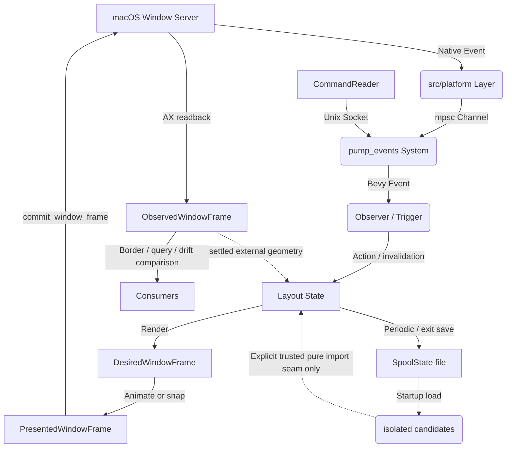

# Spool Architecture

This document provides a high-level overview of Spool's architecture for contributors. Spool is a macOS window manager built using the **Bevy Game Engine** and its **Entity Component System (ECS)**.

## 1. High-Level Overview

### Long-term declarative architecture

[ADR 0006](adr/0006-declarative-state-driven-window-management.md) establishes
fully state-driven declarative window management as the direction for future
design, implementation, and review. Commands, configuration, and scripts express
state transitions; derived effects reconcile the latest intent with macOS
observations. State admission and immediate platform executability are separate:
a valid retained layout should ultimately be editable on an invisible Space,
with effects applied when native conditions permit, without implicit focus or
Space switching. Deferred realization retains current desired state rather than
replaying obsolete commands.

This is an architectural target, not a claim of current feature completeness.
The first resource-CLI version's visible-only geometry/arrangement mutation gate
is a temporary implementation limitation. Preserve current write protections
until state admission and effects are separated. macOS still owns observed
lifecycle, topology, membership, visibility, and physical geometry; accepted
intent is distinct from confirmed native completion.

[ADR 0007](adr/0007-explicit-intent-ownership-and-realization.md) and the
[declarative state map](wayfinding/declarative-state/map.md) define the migration.
The column-width slice now stores original intent independently and accepts
background-Space width edits. Other arrangement, focus, and membership migrations
remain separate stages. See the [implementation record](wayfinding/declarative-state/implementation.md).

### Independent Native Window Identity

New discovery produces ordinary layout windows, not application tab groups.
`WindowApi::represented_window_id` encapsulates native chrome ownership: the
macOS backend retains a unique direct `AXTabGroup` and reads its `AXWindow`
owner, without enumerating or selecting tabs. Complete application inventory
validates replacement targets. Reconciliation updates the existing entity's
handle, preserving its layout slot and padding. Spawn-time bootstrap requires
a unique publication transition, matching physical geometry, same user Space
and live WindowServer ownership. Unpublished, nonpresented objects on a confirmed
visible user Space are not new layout windows; offscreen visibility alone never
excludes one. Ordinary geometry commits reject stale or mismatched control
targets. An unreadable child enumeration is not evidence of another window's
ownership: it resolves once to "no retained anchor", so a window whose
accessibility implementation never answers `AXChildren` keeps committing
against the element Spool already tracks instead of being parked permanently.
Legacy tab operations described below remain for compatibility, but automatic
tab detection no longer creates these layouts. Live evidence and remaining
acceptance are in `research/native-tab-platform-observation-2026-09-11.md`.

Spool manages macOS windows as a **sliding strip** (inspired by Niri and PaperWM). The core design philosophy is **Data-Driven/ECS**: instead of managing windows as complex objects with internal state, we represent the "World" as a collection of simple data components (Windows, Displays, Workspaces) that are processed by systems.

The primary problem Spool solves is providing a predictable, stable, and ergonomic tiling experience on macOS. By using Bevy's ECS, we gain:

- **Declarative Logic:** layout state is rendered into a desired window frame; effects and OS observations are separate projections.
- **Change-Driven Work:** Efficient change detection and budgeted event/discovery processing.
- **Modularity:** Functionality is divided into decoupled plugins and systems.

## 2. The Bevy Bridge

Bevy is typically used for games, so Spool implements a custom bridge to interact with the macOS Window Server.

### Event Ingestion (macOS -> ECS)

1. **Platform Layer:** `src/platform/` uses `objc2` and AppKit to interface with macOS. It runs a native event loop or hooks into OS notifications.
2. **Event Channel:** macOS events (mouse moves, window creations, space changes) are sent via a thread-safe `mpsc` channel.
3. **Pump System:** The `pump_events` system (in `src/ecs/systems.rs`) reads from this channel during the `PreUpdate` phase and writes Bevy `Message`s or triggers `Observer`s.
4. **Observers:** Bevy Observers (primarily in `src/ecs/triggers.rs`, with focused domain modules) react to these events to update the ECS World (e.g., spawning new `Window` entities or updating `FocusedMarker`).

### Declarative Frame Pipeline (ECS -> macOS -> ECS)

1. **Render:** `layout::position_layout_windows` derives `DesiredWindowFrame` from Layout State. This is the final target and does not advance gradually.
2. **Present:** `window_frame::animate_presented_window_frames` derives `PresentedWindowFrame` from the desired frame. Gestures and cross-Space jumps may explicitly snap this projection.
3. **Commit:** `systems::commit_window_frame` is the normal-operation geometry writer. It sends only the presented frame through the `Window` abstraction.
4. **Observe:** synchronous AX readback and external notifications update `ObservedWindowFrame`. Borders and public queries use this confirmed projection.
5. **Reconcile:** `reconcile::reconcile_windows` periodically compares desired and observed frames, retries boundedly, and also repairs missed lifecycle notifications from complete AX and WindowServer inventories.

The flow is intentionally one-way. An ordinary macOS readback never mutates tiled Layout State. User- or application-driven geometry is first collected as a `Geometry Gesture`; only the settled final frame becomes a single Layout State action. A floating window is the exception in policy rather than in retention: it has no tiling neighbours to disturb, so a settled observation is adopted immediately, and what it is adopted *into* is the window's retained frame intent (see below) rather than the frame itself.

Column width commands and script operations share `LayoutStrip` intent edits.
`ColumnId` survives reordering; `WidthIntent` distinguishes inherited configuration,
absolute slot points, and viewport ratios. Commands resolve ordinals at admission,
without activating a Space. Geometry is derived only when the owning viewport and
trusted constraints permit it; native writes independently check current eligibility.
`Balance` copies the reference column's original width variant. Maximize stores that
variant for restoration and validates any unstack before publishing changes.
`Equalize` edits those same retained stack heights: the stack-height slice moved it
to the state-edit path, so it is no longer a pending-height mechanism.
`Windows::moving_frame` overlays pending requests on the desired projection and
rejects unrepresentable frames. Resize centering uses wide intermediate arithmetic;
viewport clamping preserves representable origins and positive-size endpoints.
Snap rejects an unrepresentable strip translation instead of wrapping it.

Stack toggles plan against a cloned strip and commit only a changed, representable
layout. An ineligible toggle leaves both the strip's change tick and maximize
restore state untouched. Lua unstack also validates its proposed strip before
replacement. `LayoutStrip::stack`/`unstack` distinguish a real change from a no-op.
Column offsets are checked for the entire strip before exposing the first
projected entry: overflow emits no partial prefix and does not discard layout
membership. This is an offset guard, not proof that all global-coordinate or
command geometry arithmetic has been audited.

Layout projection pairs eligible members with their representative sizes before
packing heights. Missing or invalid geometry is omitted from the projection, not
removed from `LayoutStrip`. A native tab item uses its first eligible member and
emits only eligible siblings; stored membership/order remains intact for recovery.
Column offsets and member frames use the same solved slot width. Member frames
provide eligibility and height, never authoritative column width.

Global frame projection keeps intermediate offsets in wide integers, applies
the existing padding/sliver rules, and narrows only a representable final frame.
Ensure-visible processing skips a no-op or invalid request without starving later
markers. Viewport-origin changes validate both the current strip origin and its
pending target before rebasing either or advancing the saved viewport; rejected
rebases remain retryable. These guards do not replace native geometry readback.

**Note:** All AppKit/Accessibility calls must happen on the **Main Thread**.
Spool uses `NonSend` platform owners and single-threaded executors for startup
and frame schedules; platform initialization rejects a non-main caller.

### Native Discovery and Callback Lifetime

`src/manager/discovery.rs` owns a resumable `WindowDiscovery` queue on the main
thread. Applications take turns probing inactive-Space AX tokens. Identity and
attribute reads are separate steps, with a 256-step/2ms per-tick budget and a
250ms active-work allowance per application. These time limits are soft: one
synchronous native call may overrun them. Waiting between ticks does not consume
an application's allowance. The process-wide AX timeout is initialized through
the system-wide accessibility object, and initialization fails if setting it
fails; setting only an application object's timeout does not cover its windows.

Discovery validates the application entity, PID, process serial number, and
liveness before publication. Exit cancels pending probes. Startup retains
`Initializing` until the queue and its last spawn batch settle, so initialization
starts afterwards; the event pump keeps its short timeout during this work.
Neither AX handles nor discovered windows enter a background task pool.

Deferred admission retains its discovered token for at most three metadata
attempts within the original application allowance; definitive rejection does
not retry. Resolved windows awaiting publication retain their native handles
across unknown liveness results for up to three checks, at most once per tick.
Publication and scanning share the tick budget, and exhaustion is explicit.

WindowServer and KVO callbacks use non-reused opaque tokens to acquire owned
context leases. Teardown retires the token before unregistering, making late
delivery inert even if native removal fails. KVO's synchronous initial callback
only requests reconciliation; it never mutates the process being registered.

### The Lua Worker (optional `lua` feature)

The embedded scripting runtime is the one deliberate exception to "everything interesting happens on the main thread". A handler is arbitrary user code of unbounded duration, and `pump_events` is itself main-thread-pinned, so running handlers inline meant a slow script stalled the frame clock. `src/lua/worker.rs` runs the interpreter on a dedicated thread instead:

- **Main → worker:** `dispatch_lua_events` and `command_lua_handler` send plain event data and keybind IDs over an unbounded channel. Neither ever blocks.
- **Worker → main:** `drain_lua_outbox` non-blockingly drains queued `Action`s and flash messages onto the command bus.
- **Main-thread queue budgets:** Each effect, world-read, or store-access batch
  freezes its initial pending count and handles at most 256 requests, with a
  soft 4ms budget checked before receiving the next request. One request may
  overrun the budget, and the first pending request always makes progress.
  Unprocessed requests remain FIFO for a later pass; no request is consumed
  merely to discover that the budget has expired. World-query batches are
  consumed lazily so extraction time counts toward this budget too.
- **The query round-trip:** `spool.query*` sends a reply channel and asynchronously awaits the answer; other handlers can run meanwhile. `serve_lua_queries` answers from `QueryStateParams` in `PreUpdate` (before the pump) and again in `PostUpdate`, sharing each extraction among that pass's waiters.
- **Snapshot ownership:** Each input message owns a `DispatchBatch`. Its handlers share reads, while later batches remain independent of suspended callbacks. `DispatchWorld` installs the batch only during each future poll, so reload top-level code cannot borrow an old callback's world access. Script state is separately cached by revision.
- **Reload ownership:** Retired runtimes may finish in-flight actions, but only the installed runtime publishes handler availability. Keybind callback IDs are process-unique, so an event queued before reload cannot invoke a replacement callback. A failed reload retains the working runtime and configuration.
- **Flash duration boundary:** Lua flash durations are validated before entering the outbox; worker messages and ECS timers carry `Duration`, never unvalidated floating-point seconds.
- **Layout replay ordering:** Each recorded layout operation runs as a cached
  ECS system and flushes its observers before the next operation, including
  across handler batches. A float or retile therefore settles its markers and
  strip placement before a following stack operation reads them. Script sink
  requests use the normal retile observer's native membership and capability
  checks. Geometry requests share endpoint validation with the frame pipeline;
  an invalid request cannot overwrite an earlier valid request's markers.

`src/lua/runtime.rs` reaches the world through `DispatchWorld` rather than ECS
borrows. Only plain data crosses the worker channels; Lua values and platform
objects stay on their owning threads.

## 3. Crate & Module Map

| Directory / Module | Responsibility Statement |
| :--- | :--- |
| `src/ecs/layout.rs` | Tiling algorithms, column management, and coordinate calculations. |
| `src/ecs/window_frame.rs` | Desired/presented frame projections and animation. |
| `src/ecs/window_geometry.rs` | Debounced adoption of externally initiated move/resize gestures. |
| `src/ecs/reconcile.rs` | Lifecycle audits and bounded desired/observed convergence. |
| `src/ecs/exit_restore.rs` | Session-local launch-frame restoration and on-screen placement of live tracked windows at exit. |
| `src/ecs/systems.rs` | Bevy systems for lifecycle management, event pumping, and state syncing. |
| `src/ecs/params.rs` | High-level Bevy `SystemParam` abstractions for querying the World. |
| `src/ecs/triggers.rs` | Reactive event handlers (Observers) for OS and internal events. |
| `src/ecs/restore.rs` | Isolated saved candidates and pure atomic import with explicitly trusted bindings and a frozen initial baseline; no automatic matching. |
| `src/ecs/native_space.rs` | Native Space topology, visibility, capability-gated commands, and post-operation reconciliation. |
| `src/ecs/workspace.rs` | Native Space/display lifecycle event handling. |
| `src/ecs/scroll.rs` | Input handling for trackpad swipe gestures, inertia, and snapping. |
| `src/ecs/focus.rs` | Focus management logic, including focus-follows-mouse and mouse-follows-focus. |
| `src/ecs/state.rs` | Persistence of window layout and workspace state across restarts. |
| `src/manager/` | OS-agnostic traits (`WindowApi`, `ProcessApi`) and their macOS implementations (`WindowOS`). |
| `src/platform/` | Low-level macOS FFI, event loop integration, and workspace/input hooks. |
| `src/config/` | Configuration parsing, validation, and hot-reloading logic. |
| `src/commands.rs` | The thin ordered action reader (`dispatch_actions`) plus the command helpers shared with the executors. |
| `src/commands/admission.rs` | Command Admission: the single action reader, the shared target/layout recipes, and the typed rejection vocabulary. |
| `src/commands/` | Domain executors for targeted windows, display transfer, layout edits, and column widths. |
| `src/client.rs` | The CLI query, command, and subscription adapter over the typed IPC protocol. |
| `src/client_script.rs` | Isolated, on-demand Lua client execution; injects the socket-backed `spool` module without entering the daemon runtime. |
| `src/reader.rs` | The daemon adapter: turns authenticated local IPC requests into events. |
| `crates/local_ipc` | The deep IPC module: singleton lock, Unix socket lifecycle, peer authentication, bounded framing, deadlines, replies, and subscriptions. |
| `src/overlay.rs` | Logic for drawing active window borders and inactive window dimming. |
| `src/bar/` | The native AppKit Bar: one panel per display occupying that display's menu-bar band plus the handle's overhang, drawn on a menu-material blur backdrop. `runtime.rs` owns the pure Bar decisions (per-display interaction state and the update/animate/collapse coordination) behind the `BarSurface` port; `appkit.rs` is the production `AppKitSurface` adapter for panels, gestures and drawing; `layout.rs` owns the Space strip and its per-Space slots, and `placement.rs` the menu-bar rect, the notch and the handle's geometry. |
| `src/bar/preferences.rs` | Bar preferences parsed from `spool.setup{ bar = … }`; the band's height is resolved from the observed menu bar, never from configuration. |

### Bar presentation

Bar icons and Space decorations share `FocusCoordinator::space_selection` as
their local selection source. A focus-domain lifecycle system reconciles closed
or hidden/minimized selections against that Space's confirmed history before
either presentation runs. It does not issue activation requests or add history
entries. AX unavailability alone retains the selection. Global `FocusedMarker`
continues to represent confirmed native focus, independently of local highlights.
See the [Space focus presentation specification](wayfinding/declarative-state/issues/22-space-focus-presentation.md).

The Bar is not an `NSStatusItem`: macOS reserves no horizontal space for it, so
it takes the menu bar's own rect instead — full display width, the menu bar's
height, flush with the screen top, with no inset — and deliberately covers the
system menu bar while expanded. Its content is drawn on an
`NSVisualEffectView` using the menu material, so a `behindWindow` blur sits
behind the Spaces and icons exactly as it does behind the menu bar itself. One
small handle at the display's centre hangs below that band, so the panel window
is taller than the menu bar on every display by `placement::window_overhang` —
which is the handle at rest plus the room it grows into under the pointer.

Collapse is runtime-only presentation state. `Action::ToggleBarCollapse` raises a
one-shot `BarRequests` flag that the Bar's own schedule consumes on the next
frame; the whole Bar — band, content and its glass — then slides up out of the
screen through the display's top edge over the content's shared 240ms ease-out,
leaving the handle behind (`ChromeMotion`). It moves no window: the panel keeps
its rect for its whole life, and the blur is masked to the moving chrome rather
than faded. Because the panel is taller than the band, it is interactive only
where the pointer is on the Bar's own chrome, which hands both the menu bar
underneath and the strip beside the handle back to their owners without a second
window. Hover pulses are Core Animation layers, not frame loop work: a window
manager that wakes its whole ECS at refresh rate to animate a highlight spends
~45% of a core doing it. Nothing about collapse is persisted and every Bar starts
expanded, so the collapsed state can never be restored into a session that did
not ask for it.

That coordination lives behind a seam. `Bar` in `src/bar/runtime.rs` owns each
display's interaction state and the update/animate/collapse decisions, and
depends only on plain data — a `BarSnapshot`, the adapter's resolved screen
geometry and measured metrics, and `BarPreferences` — plus the `BarSurface`
port. It never queries the environment mid-decision, and icon images never cross
the seam: `present` resolves bundle identities inside the adapter and consumes
the pure `Presentation`. Effects leave through the port's idempotent methods
(ensure/remove panel, present, set interactivity, sync toolbar, set button
highlight, show/hide drag preview); pointer and `AppKit` interactions arrive as
plain `BarInput`, and actions leave as a returned `BarOutcome` rather than an
injected `EventSender`. `appkit.rs` provides the production `AppKitSurface`
adapter, and `RecordingSurface` in `runtime.rs`'s tests is the in-memory test
adapter for the same seam, so the coordination runs with no window server. The
port is main-thread-only and deliberately does not require `Send + Sync`,
matching the `NonSend` `BarManager` resource that holds `Bar` and
`Box<dyn BarSurface>`.

## 4. Key Data Entities

### Layout Snapshots

`WindowSet` keeps each column's canonical `StackItemSet` entries: an individual
window or an existing native tab group. A vertical stack can contain either,
without flattening native groups into unrelated entries. `ColumnSet::windows()`
is a flattened read view used by Lua `columns()` and the window-bar projection;
transforms use the structured entries for swap, stack, and unstack. The snapshot
remains immutable-by-transform and contains only `Send` data for the Lua worker.

Floating snapshot entries use a complete `NativeTopology` membership scan,
including inactive Spaces. The scan's ordered view removes repeated IDs and
excludes ambiguous memberships while preserving native list order. A partial
scan cannot establish ownership: those floating entries are temporarily omitted
from `WindowSet`, without retiring their ECS entities or changing frames. No
membership scan is needed when no available tracked windows are floating.
Snapshot visibility also requires a currently observed visible native Space;
intersecting a display rectangle alone is insufficient.

Public query records and WindowSet records share their floating membership,
Space visibility, and per-window projection. Their frame field reads only
Observed geometry; a missing readback is represented as an absent frame, not
as Presented or Desired geometry. Their output shapes differ (flat versus
structured), but those facts do not. Bar may retain a tracked identity for
restoration while AX operations are unavailable; it never invents an icon for
an unresolved native surface. Lifecycle reconciliation decides whether a
retained identity still occupies a tile and icon.

`WorkspaceSet.active` is per-display native visibility, not the global
`ActiveWorkspaceMarker`. `DisplaySet.active` identifies the globally active
display from the same topology epoch, not a retained `ActiveDisplayMarker`.
The ECS `ActiveDisplayMarker` is reconciled from that epoch by
`reconcile_native_spaces`: AppKit posts no notification when the menu bar
display changes, and a marker pinned to the launch display withdraws the active
Space from the display owning the key window and restores that Space's
remembered focus.
`WindowSet::current()` requires a unique active display and a unique
visible Space there; retained strips do not substitute for missing observations.
Focus/view/follow predictions update these two levels separately, preserve
other displays' visible Spaces, and keep the root and record focus flags aligned.
Explicit window focus also selects the existing column member without changing
native-tab order. Predicted Space changes can invalidate visibility but cannot
establish that a hidden/minimized/offscreen window has become visible.

`LayoutPlan` transports operations with an immutable `LayoutSnapshot`: a random
daemon-session UUID and the original available tracked windows' ECS entity bits
and native incarnations. `WindowSet` transformations preserve this provenance
separately from the predicted tree. `ops()` is only an inspection view; execution
uses `plan()`, including embedded callbacks, `spool.windows`, and socket clients.
`src/ecs/layout_snapshot.rs` owns capture and identity matching. Replay checks
every named endpoint and affected native tab/column member per operation, after
preceding observers have flushed. Unrelated stale windows do not reject a valid
operation, but an ID absent at capture cannot acquire a binding later.

Native Space and focus operations cross the deferred command handoff as
`LayoutSpaceRequested`, not an unbound numeric-ID action. The native command
system revalidates session and window identities, including associated windows,
before issuing an intent; the existing move transaction then owns its captured
entity/incarnation bindings. These are freshness checks, not client authentication
or a frozen world revision.

`commands::dispatch_actions` is a thin reader: it turns checked IPC requests into
admission receipts and forwards every bus action to `commands::admission`.
`admission::execute` (the checked path) and `admission::admit` (the
fire-and-forget path) are the single readers for runtime actions, including
directional window operations, named focus, Space commands, column reorder, and
effect-only actions. They share one ordered pipeline: the lifecycle and
`session_not_writable` gate, the effect-only actions, default-target resolution,
then the domain executor. The shared `Admission` recipes resolve target windows,
unique strips and displays, native membership, and layout writability in one
place, and the bounded typed `Rejection` maps to the existing snake-case IPC
codes. The reader runs after the event pump and before topology refresh. Each
command flushes its deferred changes and observers before the next command is
accepted.

The one decision that ends the session is `admission::aftermath`, a pure total
function over the action: `Stop` for `Quit`, `Restart` for `Restart`, `Nothing`
otherwise. The table marks the session `Stopping` for both, so every further
action is refused while the requester still waits; whoever owns the transport
performs the effect — `conclude_from_wire` after the receipt is written for a
checked request, `conclude_in_world` as soon as `admit` returns for a
fire-and-forget one. The reader and the command systems no longer re-derive
which actions end the session.

`Action::Layout(plan)` is the one deliberate second boundary:
`layout_ops::apply_layout_plan` replays the captured plan operation by operation,
and each operation still takes its own admission path, so native focus and
movement do not return to a separate message reader behind later actions.
Snapshot identity is checked again at the native command handoff.

Window mutations select the still-pending focus request before confirmed focus;
this does not optimistically change `FocusedMarker` or public focus state. An
unavailable or hidden pending target does not redirect the mutation to the old
window. Temporary AX withdrawal retains the request and cannot redirect edits
back to the old window. Once confirmed destruction invalidates the request, confirmed focus is again
eligible. Geometry and strip-relative commands also require the target's active
Space ownership: tiled membership comes from the strip, floating membership
from a successful native read. An accepted focus request on another display
does not authorize use of the source display's viewport. Repeated floating
movement and centering read pending geometry instead of stale observed frames.

Lua callback execution remains asynchronous; its result enters the action queue
when received. This ordering does not serialize independent state-query or
subscription readers with actions, or wait for their asynchronous effects.

The predicted tree does not make deferred operations synchronous. A Space move
or view does not guarantee that later layout operations wait for native
confirmation, and backend focus may reject a target on another display.

Local IPC uses protocol version 7. Dispatch actions carry their snake-case serde
names and payloads as a JSON string inside the postcard envelope, including
nested operations; enum declaration order no longer determines action meaning.
Renaming an action or payload field remains a wire contract change. Other
messages retain their postcard encoding. Versions 2–4 are rejected rather than
interpreted as current requests; daemon and CLI/Lua clients must be upgraded
together.
This is independent of persisted layout-state and public query-document versions.

### Cross-Display Command Admission

Display selection is a shared pure policy in `commands::display_navigation`.
Explicit `nextdisplay` cycles by native `(min.x, min.y, display_id)`, matching
the Bar's spatial ordering with an identity tie-break. Vertical fallback after
local navigation is exhausted uses the requested half-plane of display centers,
prefers horizontal overlap, then ranks edge gaps and center distance. It never
wraps when no screen exists in that direction. Selection does not depend on ECS
archetype/query order and uses widened arithmetic for coordinate differences.

Window transfer and directional focus start from the focused display. Explicit
mouse navigation starts from unique native cursor ownership, using half-open
screen rectangles so a shared edge has one owner. A gap or overlapping ownership
defers the command. Mouse/focus navigation refreshes topology and validates
source/target geometry, unique visible Spaces and target strip parentage before
warping. Focus candidates must be available, visible, uniquely belong to that
Space and have positive overlap with its usable viewport. Visible width, height
and window ID resolve selection deterministically; an empty eligible set lands
at the usable viewport center without a window-focus request. All landing
midpoints are overflow-safe. A selected destination that is not ready is not
replaced with an arbitrary peer.

`ToNextDisplay` remains a frame-based command that does not require experimental
Space control. Before changing either strip or publishing geometry and focus
effects, it checks fresh source membership, unique visible native ownership,
matching display geometry, the destination strip's parent display, and checked
usable viewports. Unknown reads, fullscreen/retiring destinations, unavailable
tab siblings, native moves already in flight, and an overflowing proposed strip
reject the request without partially removing the source layout. Pending
initialization geometry also blocks transfer admission.

The destination is the Space the target display is currently showing, and that is
deliberate rather than incidental: the command means "put this window where I can
see it on that display", so a display showing no single Space answers
`space_not_visible` — not now — instead of choosing a Space the user never picked,
and a window moved to a Space that display is not showing would leave the user's
view. Targeting a hidden Space on another display is the space-id move's job, and
that path is not gated this way.

The selected native tab group moves as one layout item. Tiled width ratios and
destination heights are planned in the command and enter the shared frame
pipeline together; there is no delayed callback carrying an old width ratio or
bare window entity. Floating windows keep their size. `Stay` restores an eligible
source tiled window when one exists. A successful local directional move ends
the action instead of also crossing a display boundary in the same invocation.

Admission captures an incarnation-bound `DisplayTransferFrame` for each member
and enters the native move transaction's ownership/geometry barrier. The source
layout remains intact. The shared committer gives each request one AX attempt,
revalidating source membership, target ownership, geometry, visibility and
floating classification at write time. This request is the only display-transfer
exception to the geometry barrier. No native Space-control command is submitted.

Physical readback is staged separately from source layout geometry. Only unique
target membership for every current, available member commits the tab group
and staged geometry. Rejection, constrained writes, incomplete observations and
partial tab arrivals cannot prematurely migrate the layout or claim focus.
Timeout/identity retirement releases transaction ownership without replaying the
AX request; the membership audit retains control of the geometry barrier.

Follow and Stay completion are identity-bound and canceled by later accepted
focus commands. Follow checks current target visibility and recomputes the
pointer destination from the current usable viewport; Stay checks the captured
source neighbour's current membership. Neither requires experimental Space
control. Associations beyond recorded native tabs, gesture-specific edge warp
selection, and live macOS acceptance remain separate review scope.

### Native Move Transactions

Move admission distinguishes native membership from ECS layout placement. A
complete membership read can avoid repeating an already completed native move,
but a retained source layout still enters the existing reconciliation path.
Only a matching layout can finish immediately without a geometry barrier;
same-Space requests then preserve column order and grouping. Confirmation also
retains an already-present target layout when admission could not prove a no-op.

Whole-column transactions capture the requested column and the existing layout
of additional tracked associated members, preserving source stacks and native
tab groups. Not-yet-placed members have individual fallback slots. Confirmation
filters this captured layout using current floating classification, never
retiling a window merely because it was tiled when the request was submitted.
Hidden and minimized members likewise stay outside live strips; confirmation
updates their `PreviousTiledStrip` destination and retains the captured insertion
index. A later show restores them through the ordinary retile path. A hidden
same-Space request is a no-op only when its remembered destination also matches.
Admission rejects tracked associated members that are temporarily AX-unavailable,
instead of silently excluding their identities from the move. AX withdrawal
after submission defers commitment; timeout still retains the geometry barrier
for the membership audit to resolve after recovery.
Existing entity/incarnation, availability, complete membership, and timeout
checks still gate commitment and release of the reassignment barrier.

Follow-focus requires current native visibility on a unique owning display,
not a retained `VisibleNativeSpaceMarker`. Disabling Space control cancels
uncompleted native Space-control follows, but not ordinary frame-based display
follows, without rolling back submitted native movement. Reenabling
does not revive those follows. A newer accepted native Space move without
following cancels older pending follows only for its affected windows, including an already
confirmed same-Space request. A new follow, accepted explicit window-focus
request, or successful explicit Space selection supersedes all older pending
follows. Submitted moves still reconcile and release their barriers normally.
Ordinary display moves schedule either follow or source-restoration focus and
supersede older pending focus completions when admitted.
Rejected Space-focus submissions and unresolved or stale window endpoints do
not cancel a valid pending follow. Already-issued platform focus events
cannot be recalled by this cancellation. An observed hide or minimize cancels
the affected member's unfinished follow, even during an AX or membership wait.
Showing the window again does not revive that follow. Moving an already hidden
window updates its membership and remembered route without implicitly showing
or focusing it.

`FocusRequestKind` separates explicit interaction from automatic focus restoration.
Space restoration, native-tab detection, keeping the previous focus for a
`dont_focus` window, and native follow completion use the automatic path. They
must not cancel the explicit follow they may be helping to complete. Ordinary
focus observations likewise do not act as a new command or advance cancellation.

### Layout Mutation Admission

A retained source strip does not grant permission to modify an in-flight move.
`Windows::layout_is_writable` requires an available window without either
`NativeMoveOwner` or `WindowSpaceReassignmentPending`. Local geometry/structure
commands and named script mutations check this before changing layout or
publishing resize/reposition requests. Ordered admission applies that check,
the lifecycle gates and the session-writability gate for every action and every
intake: a keybinding and a checked control request are refused together, and
`Center`, `Snap` and a script plan no longer have their own route around them.
Focus and floating classification retain their separate admission paths;
floating classification edits Layout State but not geometry, so a move's
ownership barrier does not refuse it.

Column-wide changes check every affected member, not just the named or focused
window. Stack/unstack and maximize include the original column; stacking also
checks the destination. Reordering/dragging columns checks every column shifted
between the two endpoints. Balance rejects atomically if any affected member
is protected. Unrelated columns remain writable, and a rejected script operation
does not discard independent operations later in the same plan.

Rejected mutations are not queued for later replay with stale source geometry.
Normal admission resumes only when both transaction ownership and the geometry
barrier have cleared. Timeout alone does not bypass an unresolved membership
barrier; native confirmation or the ordinary membership audit releases it.

### Retained Space membership and floating frames

Two per-window facts are authored state rather than observations.

`DeclaredSpace` is the Space a tracked window is declared to belong to. It must
name a Space that exists and is a user Space, or be unknown while no valid target
is known; it never holds a target that cannot be validated. An accepted membership
edit declares it — for every member the edit moves — and a fact that invalidates a
target which was valid repairs it: the Space was destroyed or merged away, it
became native fullscreen, the window ended up somewhere else, an attempt was not
confirmed in its two-second window, or a member's identity retired. Each repair is
recorded with its reason, and a repair changes state only. While an attempt is in
flight the attempt owns realization, so a lagging observation cannot pull a just
accepted declaration back. `SpaceMoveAttempt` records the last attempt and its
outcome for diagnosis only; no layout, effect, or admission decision reads it.

`FloatingGeometry` is a floating window's authored frame — position and size, one
per window rather than per Space. `derive_floating_frames` projects the frame the
pipeline presents from it, clamping it into the display that holds it and
relocating it, keeping the offset it had, when that display is gone; an inventory
that cannot be read leaves the intent alone with `unresolved` set, because unknown
is not absence. Edit commands, the external gesture observer, and the
reconciliation that adopts an observed frame all state this intent rather than
writing the frame, and the intent survives a tiled spell. Its frame is saved as an
isolated candidate with the rest of the layout intent.

### Named Window Focus

Ordinary `Action::FocusWindow` requests do not implicitly select another native
Space. Admission samples current topology and visibility. If the retained layout
names a Space, native membership in that visible Space confirms the claim with
one read. A contradicted claim falls back to the complete unique-membership
scan; an unreadable claim is refused. This shortcut deliberately accepts a
window also listed in another Space (see the Bar latency research). Windows
without a retained claim, including floating windows, use the complete scan.
A visible fullscreen Space is eligible for focus even though it is not a valid
native-move destination.

The sampler runs inside the ordered command executor, so it can observe a Space
selection issued earlier in the same batch before ECS markers catch up. It does
not wait for an asynchronous native transition: unresolved visibility still
rejects the request. A visible secondary display does not need to be the active
display; an unrelated visibility failure is acceptable, but incomplete global
Space topology cannot establish a focus destination.

`FocusSpacePolicy` keeps this distinct from bound script `focus`, which retains
its existing permission to request native Space activation through window focus.
The script endpoint still requires its original session/entity/incarnation
binding. Neither path claims that the asynchronous OS focus request succeeded.
Rejected ordinary focus does not cancel an otherwise valid pending follow, and
the shared visible-Space predicate also gates follow completion.

### Components

- **`Window`:** A wrapper around a macOS window handle (AXUIElement).
- **`Display`:** Represents a physical monitor and its bounds.
- **`LayoutStrip`:** One per native Space; manages its ordered list of `Column`s.
- **`NativeSpace`:** Stable session ID, per-display ordinal, and user/fullscreen kind read from macOS.
- **`LayoutPosition`:** A window's logical slot inside its `LayoutStrip`.
- **`Position` / `Bounds`:** Compatibility inputs used by the existing strip math while the layout model is progressively deepened. They are not physical truth and do not directly drive macOS writes.
- **`DesiredWindowFrame`:** The final geometry rendered from Layout State.
- **`PresentedWindowFrame`:** The current animation/effect output and sole normal commit input.
- **`ObservedWindowFrame`:** The latest geometry successfully read back from macOS.
- **`ColumnState` / `WidthIntent`:** Stable column identity and original width, with separate intent and structure revisions.
- **`DeclaredSpace`:** The Space a tracked window is declared to belong to, with the membership last observed and a bounded repair history.
- **`FloatingGeometry`:** A floating window's authored frame, the display it was authored against, its unresolved flag, and a bounded repair history.
- **`SpaceMoveAttempt`:** The last membership attempt and how it ended. Diagnostic only.
- **`FocusedMarker`:** Identifies the currently focused window.
- **`ActiveWorkspaceMarker`**: Identifies the currently active workspace.
- **`VisibleNativeSpaceMarker`**: Marks the native Space currently visible on each display.
- **`NativeFullscreenMarker`**: Marks a window that is in macOS native fullscreen mode.
- **`Floating`:** Marks a tracked window that is outside the tiling layout but remains focusable and operable.
- **`WindowVisibility`:** Records why a tracked window is temporarily unavailable (`Minimized` or `Hidden`) without changing whether it is tiled or floating.
- **`RepositionMarker` / `ResizeMarker`**: Command requests. For windows they are consumed into layout state; for layout strips they continue to drive strip animation.
- **`WindowFrameMotion`**: Marks a presented frame that has not converged to its desired frame.

### Resources

- **`WindowManager`:** A wrapper for the global window management state and OS bridge.
- **`WindowDiscovery`:** A main-thread-only queue for incremental inactive-Space discovery.
- **`Config`:** The current user configuration.
- **`SpoolState`**: The v6 snapshot of original column-width and stack-height intent, stack item identity, and candidate member hints.
- **`StatePersistence`**: Accepted/saved revisions, dirty state, and monotonic atomic publication.
- **`RestoreCandidates`**: Isolated input; loading it does not alter layout or issue effects.
- **`MissionControlActive`:** A flag indicating if macOS Mission Control is visible (disabling tiling).
- **`FocusFollowsMouse`:** Tracks which window should gain focus based on mouse position.

## 5. Architectural Invariants

- **Tiled stacking:** `ecs/focus/stacking.rs` derives far-to-near column order
  from confirmed focus and retained layout, filtering operational eligibility
  without selecting a different native tab. Explicit tiled-layer raises share
  the same plan. Unchanged plans do not repeat AX raises; Mission Control,
  native fullscreen, unknown visible Space, swiping, startup, and exit defer
  automatic ordering. Floating or untracked focus never raises the tiled tier.
  AX raises remain best-effort; cross-application edge hit testing requires
  native desktop acceptance, not only a mock request-order assertion.
- **Main Thread Only:** Any interaction with `objc2`, `AppKit`, or `Accessibility` APIs **must** occur on the main thread.
- **Split ownership:** ECS is the source of truth for tiling inside a Space. macOS is the source of truth for Space topology, visibility, and window membership; private operations must be reconciled from OS state before ECS converges.
- **Single-direction geometry:** Layout State writes Desired; animation writes Presented; the macOS bridge writes Observed. No projection writes backward into an earlier layer.
- **Single normal commit input:** Normal window geometry writes consume only `PresentedWindowFrame`. Fullscreen transitions, Space reassignment, and graceful exit explicitly suspend or supersede this writer.
- **Confirmed surfaces:** Borders, hit-testing heuristics, tab detection, and public frame queries use observed geometry when it exists.
- **Gesture coalescing:** Intermediate external move/resize notifications update observation only. Tiled Layout State changes once after the gesture quiet period, so neighbouring windows reflow once.
- **Pure Layout:** Layout math (in `layout.rs`) should remain as pure as possible, operating on coordinates and ratios rather than directly calling OS APIs.
- **Isolated import:** Saved candidates do not match windows automatically. The pure import seam requires trusted mappings and a frozen baseline; later edits invalidate it.
- **Reactive Power Saving:** Systems should use Bevy's reactive scheduling to avoid CPU usage when no windows are moving or events are occurring.

## 6. Intent persistence

`src/ecs/state.rs` captures retained original intent independently of native inventory
availability. Each column persists its kind and width intent, and each independently
arranged stack item persists its identity, raw positive height weight, and one member
slot per retained member. A member slot records a cached binding hint or an explicit
absence, so an identity that was not resolvable at capture shortens nothing. In-memory
capture publishes accepted and dirty revisions; periodic and exit saves sync a temporary
file, rename it atomically, and sync its directory. An old snapshot cannot replace a
newer accepted snapshot, and failure retains dirty state.

The v6 file lives at `spool/state.json` in the XDG state directory. Older formats are
ignored, not migrated. Loading creates `RestoreCandidates` only. No AX ID, title, PID or
saved Space number proves cross-daemon continuity, and an unresolved member slot never
authorizes a binding. The pure import seam validates supplied trusted bindings against a
once-frozen initial layout and refuses later edits or structural changes. No automatic
recovery or manual binding UI is supplied by this slice.

## 7. Data Flow Diagram

## 8. Testing Strategy

1. **Pure Unit Tests:** Located in `src/tests.rs` and alongside modules. These test layout math and configuration parsing without requiring a macOS environment.
2. **ECS Integration Tests:** Use Bevy's `App` or `World` to drive systems in isolation. macOS APIs are typically mocked via the `WindowApi` and `WindowManagerApi` traits.
3. **Session Restore Tests:** `src/tests/session_restore.rs` covers candidate isolation, trusted atomic import, frozen baselines, and rejection of stale edits or structural changes.
4. **FFI Verification:** Manual or semi-automated tests on macOS to ensure the Accessibility API calls behave as expected with native windows.
5. **Agent Support:** The `AGENTS.md` file provides project-specific guidance for AI agents to ensure contributions follow these architectural patterns.

## Declarative focus activation

Space preferences and navigation selection are retained separately from confirmed
history. `space prefer-focus <space-id> --window <window-id>` edits that Space's
preference and selection without activating a window or switching Spaces. This is
session-local state; the v6 layout persistence format does not replay activation.

`FocusCoordinator` owns an activation version independent of observation resolution
generations, bound to a window ID, entity, incarnation and Space. Unknown evidence
retains pending intent. The main-thread activation coordinator reserves one attempt
before calling the platform; native failures are reported, and later eligibility or
notifications never replenish the attempt. Accepted commands are not confirmed focus.

After submission, dedicated readbacks run at 250ms, 1s and 5s, then stop. These are
engineering defaults, not proven macOS stability timings. Yield requires two matching
fresh application/window/incarnation samples at least 250ms apart, complete identity
inventory, visible native membership, and no known Space transaction or Mission
Control transition. Superseded unresolved attempts remain possible own effects and
cannot be used as external-yield evidence. This conservative exclusion can leave a
request unconfirmed; it does not infer human input. Normal observation may still
confirm the current target after the dedicated readback budget ends.

Session inspection exposes `focus.actual` and `focus.activation` (version, target,
source, attempted, submission failure, outcome and readback budget). Space inspection
exposes preference and logical selection. Native inspection remains independent and
reports native facts. `FocusedMarker` and confirmed history remain observation-only.

### Decoration Space binding

Each Space decoration stays transparent while it is ordered and bound. Forward
native membership must confirm only its intended Space before alpha is restored;
a void move submission is not success. Existing surfaces are audited at one-second
intervals and revalidated after reordering. Unknown or mismatched membership hides
the surface and limits rebinding to once per second. See the
[Space overlay binding investigation](reviews/space-overlay-binding-2026-09-13.md)
for the observed two-overlays-in-one-Space failure and native validation limits.
