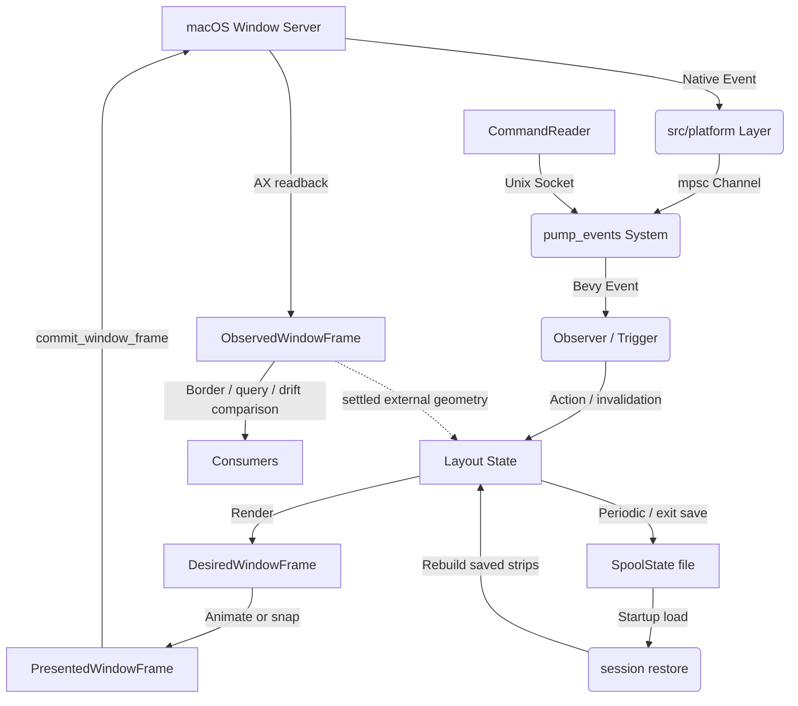

# Spool Architecture

This document provides a high-level overview of Spool's architecture for contributors. Spool is a macOS window manager built using the **Bevy Game Engine** and its **Entity Component System (ECS)**.

## 1. High-Level Overview

Spool manages macOS windows as a **sliding strip** (inspired by Niri and PaperWM). The core design philosophy is **Data-Driven/ECS**: instead of managing windows as complex objects with internal state, we represent the "World" as a collection of simple data components (Windows, Displays, Workspaces) that are processed by systems.

The primary problem Spool solves is providing a predictable, stable, and ergonomic tiling experience on macOS. By using Bevy's ECS, we gain:
- **Declarative Logic:** layout state is rendered into a desired window frame; effects and OS observations are separate projections.
- **Change-Driven Work:** Efficient change detection and budgeted event/discovery processing.
- **Modularity:** Functionality is divided into decoupled plugins and systems.

## 2. The Bevy Bridge

Bevy is typically used for games, so Spool implements a custom bridge to interact with the macOS Window Server.

### Event Ingestion (macOS -> ECS)
1.  **Platform Layer:** `src/platform/` uses `objc2` and AppKit to interface with macOS. It runs a native event loop or hooks into OS notifications.
2.  **Event Channel:** macOS events (mouse moves, window creations, space changes) are sent via a thread-safe `mpsc` channel.
3.  **Pump System:** The `pump_events` system (in `src/ecs/systems.rs`) reads from this channel during the `PreUpdate` phase and writes Bevy `Message`s or triggers `Observer`s.
4.  **Observers:** Bevy Observers (primarily in `src/ecs/triggers.rs`, with focused domains such as session restore in `src/ecs/restore.rs`) react to these events to update the ECS World (e.g., spawning new `Window` entities or updating `FocusedMarker`).

### Declarative Frame Pipeline (ECS -> macOS -> ECS)
1.  **Render:** `layout::position_layout_windows` derives `DesiredWindowFrame` from Layout State. This is the final target and does not advance gradually.
2.  **Present:** `window_frame::animate_presented_window_frames` derives `PresentedWindowFrame` from the desired frame. Gestures and cross-Space jumps may explicitly snap this projection.
3.  **Commit:** `systems::commit_window_frame` is the normal-operation geometry writer. It sends only the presented frame through the `Window` abstraction.
4.  **Observe:** synchronous AX readback and external notifications update `ObservedWindowFrame`. Borders and public queries use this confirmed projection.
5.  **Reconcile:** `reconcile::reconcile_windows` periodically compares desired and observed frames, retries boundedly, and also repairs missed lifecycle notifications from complete AX and WindowServer inventories.

The flow is intentionally one-way. An ordinary macOS readback never mutates tiled Layout State. User- or application-driven geometry is first collected as a `Geometry Gesture`; only the settled final frame becomes a single Layout State action. Floating windows are the exception because no tiling neighbours depend on their geometry.

**Note:** All AppKit/Accessibility calls must happen on the **Main Thread**.
Spool uses `NonSend` platform owners and single-threaded executors for startup
and frame schedules; platform initialization rejects a non-main caller.

### Native Discovery and Callback Lifetime

`src/manager/discovery.rs` owns a resumable `WindowDiscovery` queue on the main
thread. Applications take turns probing inactive-Space AX tokens. Identity and
attribute reads are separate steps, with a 256-step/2ms per-tick budget and a
250ms active-work allowance per application. These time limits are soft: one
synchronous native call may overrun them. Waiting between ticks does not consume
an application's allowance. The process-wide AX timeout is initialized through
the system-wide accessibility object, and initialization fails if setting it
fails; setting only an application object's timeout does not cover its windows.

Discovery validates the application entity, PID, process serial number, and
liveness before publication. Exit cancels pending probes. Startup retains
`Initializing` until the queue and its last spawn batch settle, so restore grace
starts afterwards; the event pump keeps its short timeout during this work.
Neither AX handles nor discovered windows enter a background task pool.

Deferred admission retains its discovered token for at most three metadata
attempts within the original application allowance; definitive rejection does
not retry. Resolved windows awaiting publication retain their native handles
across unknown liveness results for up to three checks, at most once per tick.
Publication and scanning share the tick budget, and exhaustion is explicit.

WindowServer and KVO callbacks use non-reused opaque tokens to acquire owned
context leases. Teardown retires the token before unregistering, making late
delivery inert even if native removal fails. KVO's synchronous initial callback
only requests reconciliation; it never mutates the process being registered.

### The Lua Worker (optional `lua` feature)

The embedded scripting runtime is the one deliberate exception to "everything interesting happens on the main thread". A handler is arbitrary user code of unbounded duration, and `pump_events` is itself main-thread-pinned, so running handlers inline meant a slow script stalled the frame clock. `src/lua/worker.rs` runs the interpreter on a dedicated thread instead:

- **Main → worker:** `dispatch_lua_events` and `command_lua_handler` send plain event data and keybind IDs over an unbounded channel. Neither ever blocks.
- **Worker → main:** `drain_lua_outbox` non-blockingly drains queued `Action`s and flash messages onto the command bus.
- **The query round-trip:** `spool.query*` sends a reply channel and asynchronously awaits the answer; other handlers can run meanwhile. `serve_lua_queries` answers from `QueryStateParams` in `PreUpdate` (before the pump) and again in `PostUpdate`, sharing each extraction among that pass's waiters.
- **Snapshot ownership:** Each input message owns a `DispatchBatch`. Its handlers share reads, while later batches remain independent of suspended callbacks. `DispatchWorld` installs the batch only during each future poll, so reload top-level code cannot borrow an old callback's world access. Script state is separately cached by revision.
- **Reload ownership:** Retired runtimes may finish in-flight actions, but only the installed runtime publishes handler availability. Keybind callback IDs are process-unique, so an event queued before reload cannot invoke a replacement callback. A failed reload retains the working runtime and configuration.
- **Flash duration boundary:** Lua flash durations are validated before entering the outbox; worker messages and ECS timers carry `Duration`, never unvalidated floating-point seconds.

`src/lua/runtime.rs` reaches the world through `DispatchWorld` rather than ECS
borrows. Only plain data crosses the worker channels; Lua values and platform
objects stay on their owning threads.

## 3. Crate & Module Map

| Directory / Module | Responsibility Statement |
| :--- | :--- |
| `src/ecs/layout.rs` | Tiling algorithms, column management, and coordinate calculations. |
| `src/ecs/window_frame.rs` | Desired/presented frame projections and animation. |
| `src/ecs/window_geometry.rs` | Debounced adoption of externally initiated move/resize gestures. |
| `src/ecs/reconcile.rs` | Lifecycle audits and bounded desired/observed convergence. |
| `src/ecs/exit_restore.rs` | Session-local restoration of eligible pre-Spool window geometry. |
| `src/ecs/systems.rs` | Bevy systems for lifecycle management, event pumping, and state syncing. |
| `src/ecs/params.rs` | High-level Bevy `SystemParam` abstractions for querying the World. |
| `src/ecs/triggers.rs` | Reactive event handlers (Observers) for OS and internal events. |
| `src/ecs/restore.rs` | Startup session restore planning and application, including window matching, layout rebuilding, and restore grace-period handling. |
| `src/ecs/native_space.rs` | Native Space topology, visibility, capability-gated commands, and post-operation reconciliation. |
| `src/ecs/workspace.rs` | Native Space/display lifecycle event handling. |
| `src/ecs/scroll.rs` | Input handling for trackpad swipe gestures, inertia, and snapping. |
| `src/ecs/focus.rs` | Focus management logic, including focus-follows-mouse and mouse-follows-focus. |
| `src/ecs/state.rs` | Persistence of window layout and workspace state across restarts. |
| `src/manager/` | OS-agnostic traits (`WindowApi`, `ProcessApi`) and their macOS implementations (`WindowOS`). |
| `src/platform/` | Low-level macOS FFI, event loop integration, and workspace/input hooks. |
| `src/config/` | Configuration parsing, validation, and hot-reloading logic. |
| `src/commands.rs` | Implementation of CLI subcommands. |
| `src/client.rs` | The CLI query, command, and subscription adapter over the typed IPC protocol. |
| `src/client_script.rs` | Isolated, on-demand Lua client execution; injects the socket-backed `spool` module without entering the daemon runtime. |
| `src/reader.rs` | The daemon adapter: turns authenticated local IPC requests into events. |
| `crates/local_ipc` | The deep IPC module: singleton lock, Unix socket lifecycle, peer authentication, bounded framing, deadlines, replies, and subscriptions. |
| `src/overlay.rs` | Logic for drawing active window borders and inactive window dimming. |

## 4. Key Data Entities

### Components
- **`Window`:** A wrapper around a macOS window handle (AXUIElement).
- **`Display`:** Represents a physical monitor and its bounds.
- **`LayoutStrip`:** One per native Space; manages its ordered list of `Column`s.
- **`NativeSpace`:** Stable session ID, per-display ordinal, and user/fullscreen kind read from macOS.
- **`LayoutPosition`:** A window's logical slot inside its `LayoutStrip`.
- **`Position` / `Bounds`:** Compatibility inputs used by the existing strip math while the layout model is progressively deepened. They are not physical truth and do not directly drive macOS writes.
- **`DesiredWindowFrame`:** The final geometry rendered from Layout State.
- **`PresentedWindowFrame`:** The current animation/effect output and sole normal commit input.
- **`ObservedWindowFrame`:** The latest geometry successfully read back from macOS.
- **`WidthRatio`:** A window's relative width in the tiling strip.
- **`FocusedMarker`:** Identifies the currently focused window.
- **`ActiveWorkspaceMarker`**: Identifies the currently active workspace.
- **`VisibleNativeSpaceMarker`**: Marks the native Space currently visible on each display.
- **`NativeFullscreenMarker`**: Marks a window that is in macOS native fullscreen mode.
- **`Floating`:** Marks a tracked window that is outside the tiling layout but remains focusable and operable.
- **`WindowVisibility`:** Records why a tracked window is temporarily unavailable (`Minimized` or `Hidden`) without changing whether it is tiled or floating.
- **`RepositionMarker` / `ResizeMarker`**: Command requests. For windows they are consumed into layout state; for layout strips they continue to drive strip animation.
- **`WindowFrameMotion`**: Marks a presented frame that has not converged to its desired frame.

### Resources
- **`WindowManager`:** A wrapper for the global window management state and OS bridge.
- **`WindowDiscovery`:** A main-thread-only queue for incremental inactive-Space discovery.
- **`Config`:** The current user configuration.
- **`SpoolState`**: The v3 durable snapshot of displays and one layout per native Space, used for recovery after restarts.
- **`SessionRestore`**: A short-lived startup resource that keeps loaded state and restore timing active until the startup grace period expires.
- **`MissionControlActive`:** A flag indicating if macOS Mission Control is visible (disabling tiling).
- **`FocusFollowsMouse`:** Tracks which window should gain focus based on mouse position.

## 5. Architectural Invariants

- **Main Thread Only:** Any interaction with `objc2`, `AppKit`, or `Accessibility` APIs **must** occur on the main thread.
- **Split ownership:** ECS is the source of truth for tiling inside a Space. macOS is the source of truth for Space topology, visibility, and window membership; private operations must be reconciled from OS state before ECS converges.
- **Single-direction geometry:** Layout State writes Desired; animation writes Presented; the macOS bridge writes Observed. No projection writes backward into an earlier layer.
- **Single normal commit input:** Normal window geometry writes consume only `PresentedWindowFrame`. Fullscreen transitions, Space reassignment, and graceful exit explicitly suspend or supersede this writer.
- **Confirmed surfaces:** Borders, hit-testing heuristics, tab detection, and public frame queries use observed geometry when it exists.
- **Gesture coalescing:** Intermediate external move/resize notifications update observation only. Tiled Layout State changes once after the gesture quiet period, so neighbouring windows reflow once.
- **Pure Layout:** Layout math (in `layout.rs`) should remain as pure as possible, operating on coordinates and ratios rather than directly calling OS APIs.
- **Bounded Restore:** Saved session state is only consulted during startup restore. After `SessionRestore` expires, normal config and window-rule placement owns newly discovered windows.
- **Reactive Power Saving:** Systems should use Bevy's reactive scheduling to avoid CPU usage when no windows are moving or events are occurring.

## 6. Session Restore

`src/ecs/state.rs` extracts and persists the restart snapshot. The state file is
written atomically to `spool/state.json` in the XDG state directory
(`~/.local/state/spool/state.json` on a default macOS setup) and is loaded
during Bevy app setup.

`src/ecs/restore.rs` owns startup restore. It keeps the loaded `SpoolState`
alive in `SessionRestore` for the configured grace period so applications have
time to reopen their windows. As windows arrive, `restore_window_state` builds a
restore plan from the saved state and the currently tracked ECS windows.

Window matching prefers stable identity (`window_id`, `pid`, and `bundle_id`)
and uses the conservative fallback identity only when it can do so
unambiguously. The fallback includes `bundle_id`, window title when available,
window identifier, role, and subrole. Saved windows that are missing at startup
are ignored by default, and the restored layout is compacted around the matched
windows.

Restore rebuilds one `LayoutStrip` per native Space and its display
association. When the current macOS Space
to display mapping conflicts with saved display data, the current mapping is
preferred; otherwise restore falls back to the saved display, then the active
display, then any available display. Matched startup windows skip static
`[windows]` placement so the saved session wins, while unmatched windows and
post-grace windows follow normal config behavior.

## 7. Data Flow Diagram

## 8. Testing Strategy

1.  **Pure Unit Tests:** Located in `src/tests.rs` and alongside modules. These test layout math and configuration parsing without requiring a macOS environment.
2.  **ECS Integration Tests:** Use Bevy's `App` or `World` to drive systems in isolation. macOS APIs are typically mocked via the `WindowApi` and `WindowManagerApi` traits.
3.  **Session Restore Tests:** `src/tests/session_restore.rs` covers restore planning, missing-window compaction, startup grace behavior, config precedence, native Space restoration, and multi-display fallback.
4.  **FFI Verification:** Manual or semi-automated tests on macOS to ensure the Accessibility API calls behave as expected with native windows.
5.  **Agent Support:** The `AGENTS.md` file provides project-specific guidance for AI agents to ensure contributions follow these architectural patterns.
