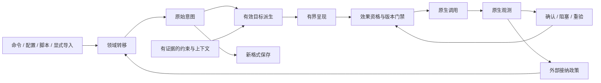

# Spool 声明式状态：实施规格导航

Status: Finalized; all 19 decisions resolved.
Implementation: First migration slice implemented on 2026-09-13; native desktop acceptance pending.
Baseline: bfce482，工作开始时核实；实施前重新检查checkout。

本轮已完成独立专家评估和用户逐项裁决，共19张决策票全部解决，地图关闭。结论包括用户明确确认和用户授权下的三专家一致结论，两种授权来源在票中分别记录。本文件是已定稿的规划交接。用户随后于2026-09-13授权实施，首片实现与 mock 验收见 [实施记录](implementation.md)；安装部署和真实桌面验收仍未执行。

## 目标与状态通路

首个切片是“不可见Space的列宽编辑立即接纳，条件允许时实现最新意图”，同时贯通诊断及新格式意图保存。完整定义、替换入口、验收矩阵与阶段次序只存于 [首个完整迁移切片及后续次序怎样验收](issues/10-migration.md)。

图中的观察属于运行期协调输入；独立native检查仍为另一条只读现实证据来源，不混入Spool意图或执行结果。原生事实进入意图必须经过接纳政策，不能直接反向赋值。

## 决策导航

| 关心的问题 | 权威决策 |
|---|---|
| 总范围、无旧兼容及自主推进授权 | [范围、开发期原则与决策授权](issues/01-scope.md) |
| 外部拖缩/聚焦/归属与旧意图竞争 | [外部操作如何取代旧意图](issues/02-external-policy.md)、[接纳证据](issues/06-evidence.md) |
| 原始尺寸与可实现目标 | [能力约束下如何保留意图与派生有效目标](issues/03-constraints.md)、[列宽表示与求解](issues/17-layout-intent.md) |
| 状态属于谁、谁能写 | [意图、焦点记忆与原生事实分别由谁写入](issues/05-state-ownership.md) |
| 最新版本、原生资格、重试与结果 | [最新意图的执行资格、重试和回执如何协调](issues/07-reconciliation.md) |
| 暂缺、真销毁、空列和拓扑合并 | [意图寿命](issues/04-lifecycle.md)、[布局生命周期](issues/08-topology-lifecycle.md) |
| Space拆分后子列宽度 | [Space 拆分后的子列是否继承宽度意图](issues/11-split-width.md) |
| 外部几何防抖与稳定读回 | [外部几何接纳采用哪种稳定采样默认值](issues/12-stability-default.md) |
| 几何尝试上限与只读检查节奏 | [几何重试与被动确认采用什么预算](issues/14-retry-budget.md) |
| 新列初始化宽度 | [新列默认宽度来自配置还是接纳时观测](issues/18-column-initialization.md) |
| 动画中途失败的计数 | [动画在终点前失败如何计入尝试预算](issues/19-animation-budget.md) |
| 稳定焦点竞争后的让权 | [来源不明的焦点竞争是否终止旧激活意图](issues/13-focus-yield.md) |
| 明确聚焦请求的尝试次数 | [稳定竞争成立前是否允许焦点重试](issues/15-focus-retry.md) |
| 配置、保存、候选与恢复范围 | [意图导入协议](issues/09-state-import.md)、[首切片恢复范围](issues/16-first-slice-restore.md) |

[领域词汇](../../CONTEXT.md)定义新模型概念；[现有架构](../../ARCHITECTURE.md)描述当前实现，不因这些规划文件新增而声称已完成迁移。

## 规划完成状态

没有待裁决事项。专家历史意见保留在各票Votes中，最终规则以Answer为准，不以历史多数票或主持人旧建议代替用户裁决。

实施必须覆盖首片已有生命周期情形、已确定的默认参数以及动画失败计数，不仅验证普通显式设宽。后续焦点迁移遵守不自动重试；列宽首片仍要求零额外激活。

## 交付与验证边界

- 规划阶段交付地图、19张决策票、领域术语和本导航。用户随后授权的首片实现与验证结果统一记录于 [实施记录](implementation.md)。
- 首片保存与候选读取不代表实际跨进程恢复；旧自动恢复 writer 已移除。
- mock 验收不能证明真实 macOS 行为；安装、服务重启和实际桌面验收尚未执行。
- 后续排列/高度、焦点、归属迁移仍按迁移票顺序推进；已定政策无需重新询问。
